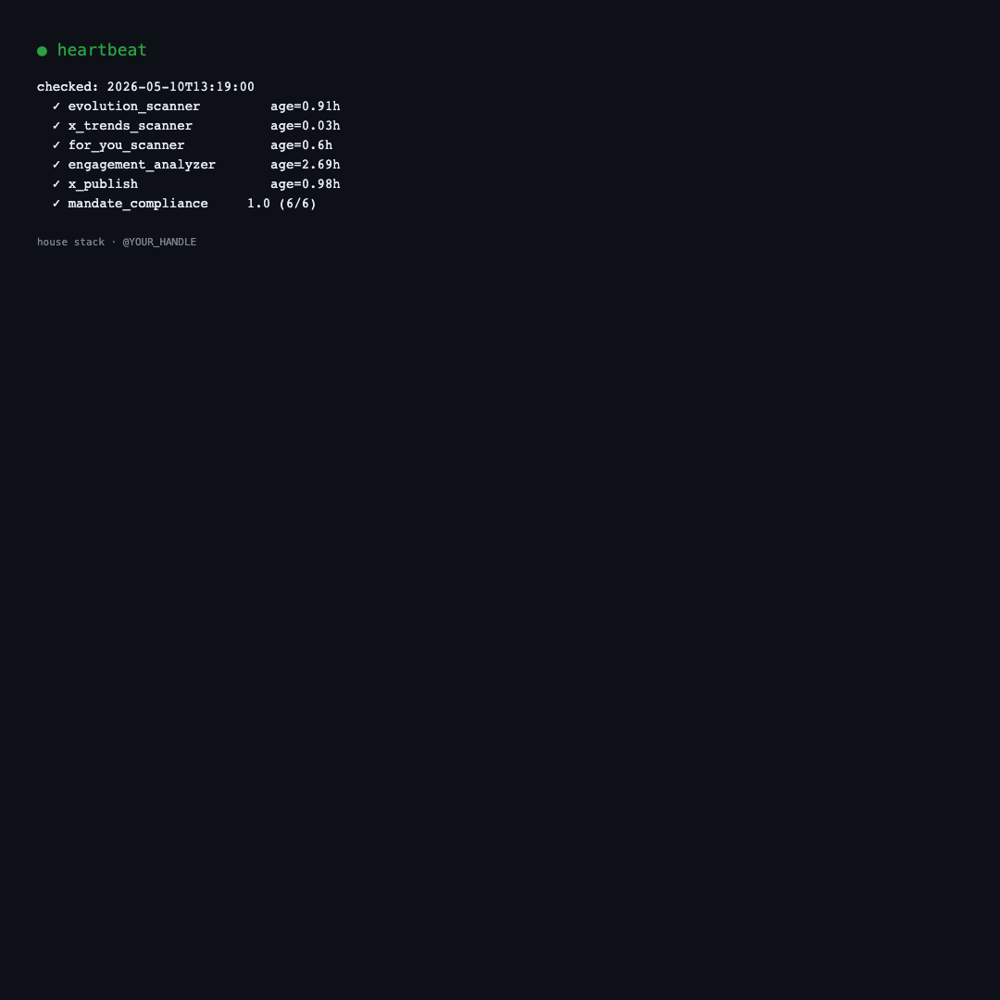
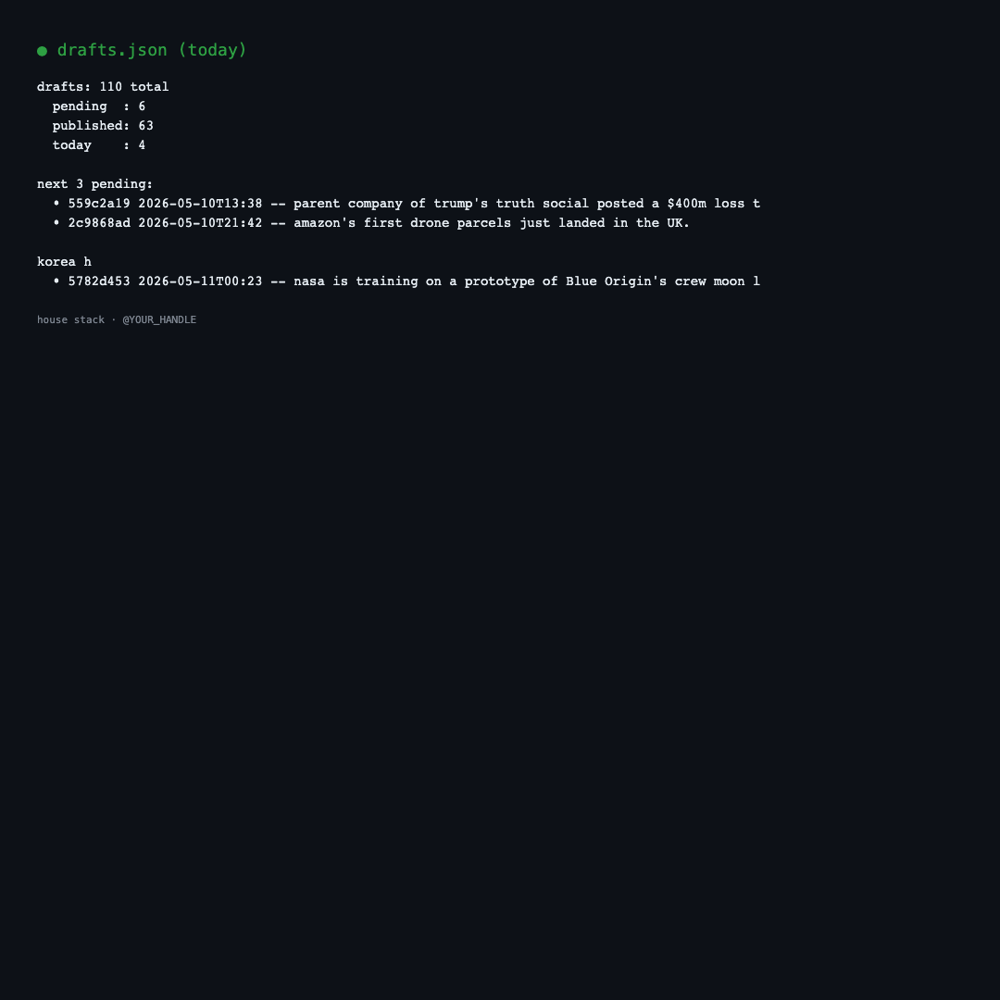
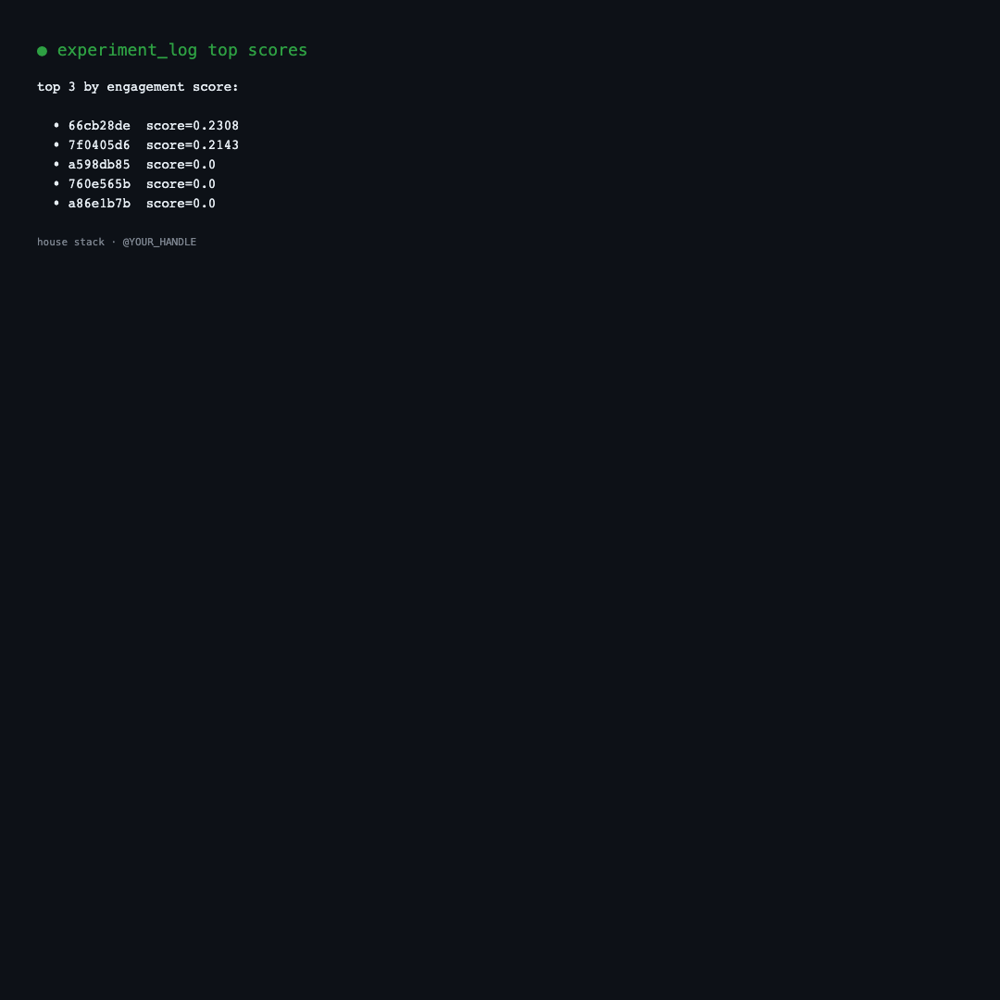
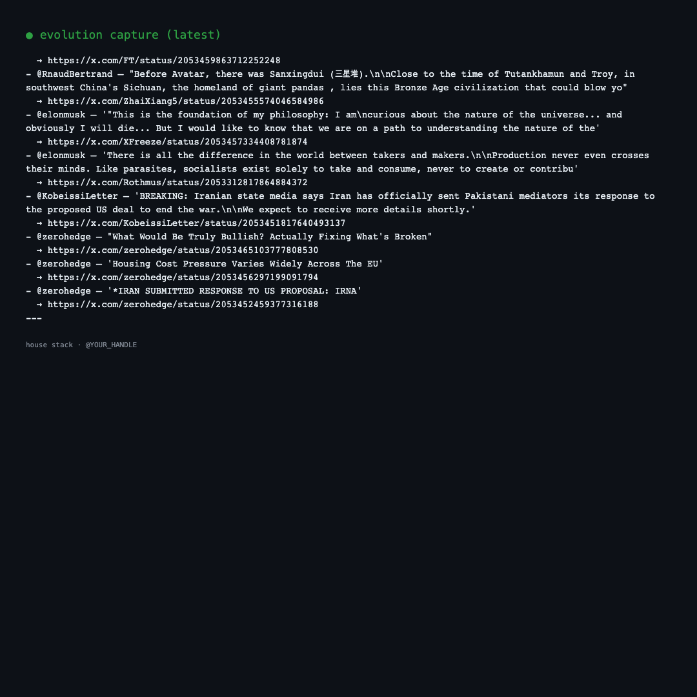
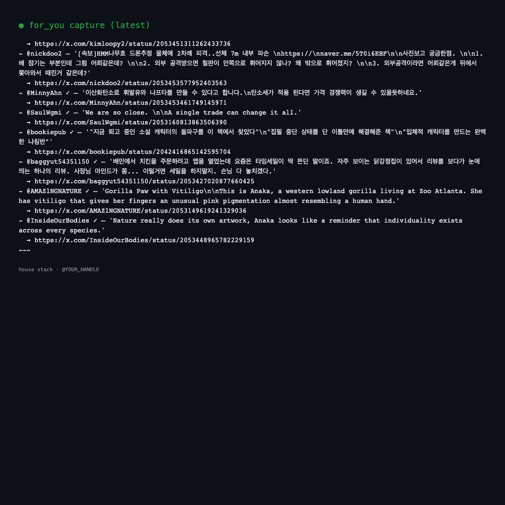

# House Stack

> X automation template for Korean indie builders going for 100K+ followers.
> Battle-tested 12 days running. MIT license. Fork it.

```
┌─────────────────────────────────────────────────────────┐
│              House Stack — daily flow                   │
├─────────────────────────────────────────────────────────┤
│                                                         │
│  hourly capture     drafts.json    publish + analyze    │
│  ──────────────     ───────────    ─────────────────    │
│  evolution_scanner    →            scheduler.py         │
│  x_trends_scanner     →   queue    publish.py           │
│  for_you_scanner      →            ↓                    │
│  notification_tracker              X                    │
│                                    ↓ (24h later)        │
│                                    engagement_analyzer  │
│                                    ↓                    │
│                                    experiment_log.md    │
│                                    ↓ (weekly)           │
│                                    weekly retro         │
│                                    ↓                    │
│                                    MANDATES.md update   │
│                                    (self-evolving)      │
└─────────────────────────────────────────────────────────┘
```

## What's in it

### Capture layer (hourly cron)
- `evolution_scanner.py` — orbit accounts (yacineMTB, tszzl, swyx, levelsio) + search queries (claude code, agentic engineering, vibe coding). Output: `library/evolution/{date}.md`
- `x_trends_scanner.py` — Korean trending + Korea explore feed
- `for_you_scanner.py` — your personalized algo recs from /home For You feed
- `notification_tracker.py` — engagement notifications, 15-min polling

### Generation layer
- `publish.py` — Playwright X publish (single, reply, quote). Free, no API tier.
- `scheduler.py` — 30-second polling, fires drafts.json scheduled posts
- 6 scheduled-task SKILL.md prompts — morning/afternoon/evening polish + night briefing + tech research + weekly retro

### Quality layer
- `quality_gate.py` — auto-catches:
  - 50+ AI tells (delve, tapestry, harness, "It's not X, it's Y", em-dash spam)
  - Korean 직역체 (~에 의해, ~가지고 있다, ~하는 것)
  - Banned consonant reactions (ㅋㅋ, ㅎㅎ if brand-banned)
  - Parallel symmetric structures
  - English metaphor in Korean ("fire가 fire를")
  - Fabrication risk patterns
- 8 reviewer council — substance, brand fit, hook, risk, cadence, receipts, hook auditor, authenticity
- `voice/` — observed_patterns, banned, signatures (real human voice patterns documented)

### Engagement layer
- `auto_engager.py` — verified-account auto-replies, rate-limited 5-10/hr
- `notification_tracker.py` → `engagement_log.json`

### Self-evolving layer (Karpathy AutoResearch pattern)
- `engagement_analyzer.py` — 24h after publish, scrapes engagement metrics, scores per X 2024+ algo weights (reply×5 + quote×3 + bookmark×4 + retweet×3 + like×1 / views)
- `experiment_log.md` — every post is an experiment, logged with hypothesis tags
- Weekly retro task reads log → proposes mandate updates → writes back to `MANDATES.md`
- Loop: experiment → analyze → improve → next cycle

### Health layer
- `heartbeat.py` — every 30 min: cron freshness check + mandate compliance % across all pending drafts
- Night-pause aware (KST 0-5 cron paused, allowed)
- Alerts append to `heartbeat_log.md`

## Quickstart (30 min)

```bash
# 1. Clone
git clone <this-repo> ~/your-x
cd ~/your-x

# 2. Python env
python3 -m venv auto/.venv
source auto/.venv/bin/activate
pip install playwright
playwright install chromium

# 3. Customize identity
#    Edit house/constitution.md — replace YOUR_HANDLE / YOUR_LOCATION / {USER}
#    Edit house/MANDATES.md — your north star + voice rules

# 4. Login to X
python3 auto/login_setup.py
#    (logs into X with your account, saves session in .chrome-profile/)

# 5. First draft
#    Edit auto/drafts.json with your first post (see schema in ONBOARDING.md)

# 6. Test publish
python3 auto/scheduler.py
#    (polls drafts.json every 30s, fires scheduled posts)

# 7. Cron everything
#    See ONBOARDING.md "Cron entries" section for crontab -e additions
```

Full 30-min walkthrough: `ONBOARDING.md`.

## Pro plan light version

Anthropic Pro plan has a 5-hour sliding window limit. Heavy autonomous setups (4 daily polish cycles + tech research + retro) blow through it.

For Pro users, the light version runs:
- Morning polish only (1× daily)
- Weekly retro only (1× per week)
- All cron-only workers stay on (zero Claude usage — Playwright + Python only)

See `ONBOARDING.md` §6.5 for full Pro-light setup.

## Daily flow

After setup, your day looks like:

```
06:23 evolution_scanner cron        ← captures from orbit
07:17 x_trends_scanner cron         ← captures Korea trends
07:43 for_you_scanner cron          ← captures your algo recs
11:31 morning polish                ← Claude reads captures + drafts.json,
                                       picks 8-15 posts for next 24h, schedules
12:30 publish #1 fires (auto)
14:15 publish #2 fires (auto)
...
13:37 engagement_analyzer cron      ← scrapes 24h-old posts engagement
22:00 weekly retro (Sun)            ← AutoResearch loop: analyze + update mandates
23:33 night briefing                ← Daily Performance Report
```

You wake up to results. Night briefing tells you what worked.

## Voice modes built in

- **viral light** (default — yacineMTB / tszzl pattern): 1-3 line punchlines, lowercase ok, weird affection, self-mock
- **News commentary** (paulg / levie): English-primary, period-terminated, stance line
- **Reflective literary** (gimhyeo): long flowing sentences, 1st-person past anchor
- **Casual observation** (haaaaanna__): atmospheric short Korean fragments

Quality gate enforces them. Voice mandate in MANDATES.md.

## What this is NOT

- Not a "post your AI thoughts" tool. AI doesn't write your posts. AI **gates** whether posts are worth shipping.
- Not engagement bot spam. Reply discipline is rate-limited + quality-gated.
- Not a thread machine. Volume target 8-15 posts/day, mostly 1-3 lines.
- Not optimized for X Premium algorithmic boost. Optimized for organic compound.

## File map

```
auto/                  Playwright + Flask publish stack
├── publish.py         X publish (single/reply/quote)
├── scheduler.py       30s poll, fires drafts.json
├── server.py          Flask 5050 — queue API + UI
├── evolution_scanner.py
├── x_trends_scanner.py
├── for_you_scanner.py
├── auto_engager.py
├── engagement_analyzer.py
├── notification_tracker.py
└── drafts.json        ← your queue

house/
├── constitution.md    Identity + voice + north star
├── MANDATES.md        Single source of truth — every task reads first
├── voice/
│   ├── banned.md
│   ├── signatures.md
│   ├── observed_patterns.md
│   └── naturalness_study.md
├── reviewers/         8 reviewer SKILL.md
│   └── 8_authenticity_auditor.md  ← THE AI-tell catcher
├── workers/
│   ├── quality_gate.py
│   ├── heartbeat.py
│   └── ...
└── experiment_log.md  ← engagement_analyzer output
```

## License

MIT. Take it. Fork it. Replace placeholders. Ship.

## Built by

Korean indie going for 100K+ from one laptop. Day 12 receipt below ↓

[link to launch thread once 5/15]

## Receipts

Sample output of the running stack — actual screenshots from day 12.

### Heartbeat status (every 30 min)


### Drafts queue


### Experiment log (engagement scoring)


### Evolution capture (orbit accounts)


### For You feed capture

